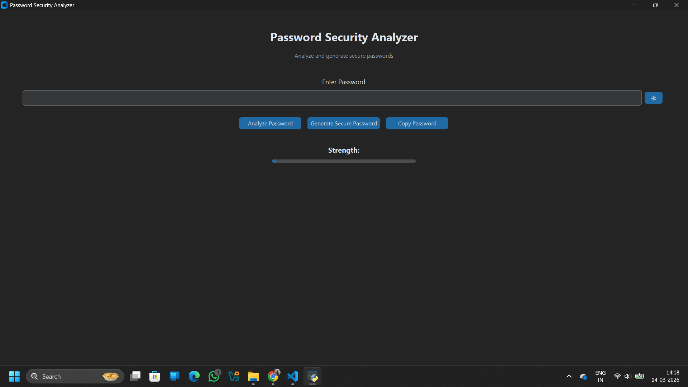
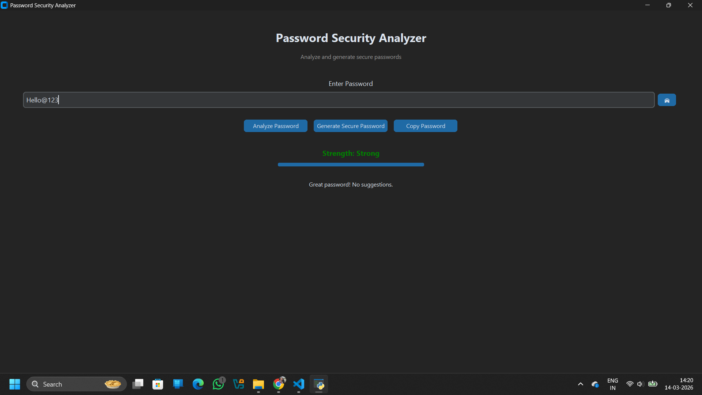

# Password Security Analyzer

A modern desktop application that analyzes password strength, generates secure passwords, and provides improvement suggestions.

## Features
- Password strength analysis
- Secure password generator
- Password visibility toggle
- Copy password to clipboard
- Strength progress meter
- Modern dark UI using CustomTkinter

## Technologies Used
- Python
- CustomTkinter

## Application Preview

### Home Screen

### Password Analysis

